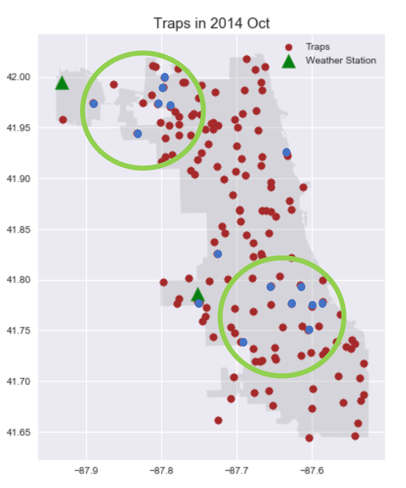

# Project 4: West Nile Virus prediction
#### Ivan Tan, Andy Chan, Jeremy Tan, Gan Hong Yee DSI-17 Singapore
#### 15 October 2020

## Problem Statement

### Goal of project
- Predict when and where different species of mosquitos will test positive for West Nile virus
- Kaggle submission
- Identify a cost effective plan to deploy pesticides spraying location
- Conduct a cost-benefit analysis

### Types of model that will be developed
- Logistic Regression
- Multinomial Naive Bayes
- Gradient Boosting Classifier
- Random Forest Classifier
- Xgboost Classifier
- DecisionTree Classifier
- ExtraTrees Classifier

### Success Evaluation
- For prediction: Model that has the highest ROC AUC score
- Kaggle Leaderboard ROC AUC submission score

### Project Scope
#### Context
- Data scientists colleagues working at Disease And Treatment Agency, division of Societal Cures In Epidemiology and New Creative Engineering (DATA-SCIENCE)

- Chicago Department of Public Health (CDPH) who established a comprehensive surveillance and control program

- Chicago City who is deploying the spraying of pesticides

- Biostatisticians and epidemiologists of CDC members

- The general public whose health is at risk for west nile virus

#### Needs
Identify where and when the mosquitos are tested positive

#### Vision

The ultimate aim of this project is to have a prediction model that can provide knowledge on where and when different species of mosquitos will test positive for West Nile virus. This is to determine a cost effective plan to deploy pesticides spraying locations as pesticide is expensive and have adverse effects on human. Hence pesticides should be use with caution.

#### Outcome

**How is the solution supposed to be used?**

We are a group of data scientist who works at the Disease And Treatment Agency, division of Societal Cures In Epidemiology and New Creative Engineering (DATA-SCIENCE). Recent West Nile virus outbreak from mosquito, has been the most commonly spread virus to human. Around 20% of the people who become infected with the virus developed symptoms ranging from a persistent fever, to serious neurological illnesses that can result in death. As changing climate allows mosquito population to increase, these control efforts will become more difficult. This risk is why the Chicago Department for Public Health (CDPH) established a surveillance and control program in 2004. Every week from late spring through the fall, mosquitos in traps across the city are tested for the virus. The results of these tests is used to generate WNV predictions based on the appropriate classifier model we built. This way, we can predict the information of when and where different species of mosquitos will test positive for West Nile virus and detect at-risk sites earlier. We can now spray sooner, reducing public exposure to the virus. The prediction enables the city to spray areas that was predicted to be WNV positive, for two weeks(life cycle of mosquito is 8 to 10 days) in a row, effectively reducing the impact of virus. In addition, we can also reduce large scale of pesticides used to spray around in the city of Chicago by spraying only at model predicted WNV positive areas. Pesticides not only expensive, it also pose health concerns to humans if overexposed. As such, we need to control pesticide usage by deploying a cost effective spray plan using our classifier model.

Top predictors identified by our Xgboost classifier is:\
1) Species - Culex Pipens/Restuans\
2) During July and August during Summer whereby temperature is high and humid.\
3) At trap locations T900, T035, T009, T002, T011, T073, T082, T223, T008, T054

**How will the solution be integrated into the organization?**

Given this week’s CDPH mosquito traps results, we can use it to generate predictions based on our model, to find out whether there will be WNV positive at a location. Building an algorithm that can detect at-risk sites earlier means that we can spray sooner, reducing public exposure to the virus. The prediction enables the city of Chicago to spray areas that was predicted to be WNV positive, for two weeks in a row, effectively reducing the impact of virus. This is a great effort from Chicago’s Data Science team.

**Who from the organization will perform this deployment?**

CDPH members, CDC members who are biostatisticians and epidemiologists

**Who is going to use this solution to make a difference?**

Decision-makers, focusing almost exclusively on cost-benefit analysis.

**How will the success of the solution be measured?**

From a data science perspective, the success metric is the ROC AUC score. From the social perspective, success metric is the reduction of West nile virus infected count. 

### Stakeholders
Primary stakeholders:
- Decision-makers, focusing almost exclusively on your cost-benefit analysis
- Chicago Department of Public Health (CDPH) who established a comprehensive surveillance and control program and deploying peticides spraying
- Biostatisticians and epidemiologists of CDC members

Secondary stakeholders:
- The general public, Chicago City

### Data Science Problem
# This is a binary classification problem which predicts whether different species of mosquitos will be tested positive for West Nile virus, based on where and where they were captured

## Executive Summary
We are a group of data scientist who works at the Disease And Treatment Agency, division of Societal Cures In Epidemiology and New Creative Engineering (DATA-SCIENCE). Chicago Department for Public Health (CDPH) established a surveillance and control program in 2004 to combat outbreak of West Nile Virus and thus every week from late spring through the fall, mosquitos in traps across the city are tested for the virus. Through the use of mosquito results as train dataset, we studied the relationship between positive West nile virus(WNV) and various conditions/variables for their impact on WNV test results.

The results of these tests is then used to generate WNV predictions based on appropriate model(XGboost classifier) we build. Prediction is on when, where various mosquito species will be tested positive. Finally, we studied and interpreted the XGboost classifier model that we used in the context of how certain features predicts positive mosquito test results.

Initial exploratory data analysis showed that:
Findings from Exploratory Data Analysis:
- Increase in number of mosquitos in July and August, due to rising temperature, humidity and with later sunrise.
- Fogging in general helps to control the population of the mosquitos, especially in 2013.
- The majority of the species carrying the virus are Culex Pipiens and Culex Restuans, they also tend to be the dominant population.

After evaluating all the models, the final optimized model is the XGboost classifier, with the following parameters:
- eval_metric='auc'
- subsample = 1
- colsample_bytree = .15
- learning_rate = .05
- max_depth=3
- scale_pos_weight=19
- n_estimators=500
- reg_alpha=.9
- reg_lambda= 5
- gamma=0.01

After studying the coefficients of our variables/features after XGBoost Classifier, it appears the below factors are able help us identify the species, locations an when mosquito will be tested positive.

**Where?**
Based on the model prediction, the areas that requires highest attention are location around traps T900, T002, T008 and T225 as these are areas with the highest chance of an outbreak with large population of mosquitos. The secondary areas are traps with which the model predicts to have high probabilities of an outbreak. They are location around traps T009, T035, T009, T011, T073, T223, T082, T054, T102, T080, T235, T077, T226, T237, T156 and T076.
This is illustrated in the map below.

**Species?**
The model also determined that the type of species determines how likely the mosquitoes are infected with WNV. Out of the top 7 determinants, 3 of them relates to the mosquitoes' species. Specifically, the most infectious species are **Culex Pipiens and Culex Restauns**.

**When?**
Based on our model, weather condition also has a direct correlation to the number of mosquitos and the presence of WNV. This is consistent with our EDA. Based on weather pattern which was also considered in our model, there is a peak during the months of **July and August**. This is also because it is summer period where conditions hot and humid, are very ideal for breeding. 

**Areas for expansion and future exploration:**
- Moving forward, the model can be continuously improved by introducing more new data to it. As this data is a highly imbalance one, ROC AUC and other metrics can be improved if more WNV positive information were introduced. Hence better predictions for us Data Scientist and stakeholders such as City of Chicago and CDPH.
- We recommend to take into consideration the inhabitants population density of the areas into the dataset in order to asses the importance of eradicating the mosquitos. This could provide important clues about the right choice of spraying and WNV detection rate.
- Since our ROC AUC for the viable classification model is 0.69 based on Kaggle results. Since value is not great, we can adjust the spray plan accordingly to compensate for the weaker prediction.
- Data from other mosquito-borne illness such as more threatening Zika virus or Aedes aegypti can also be added to expand the model to not limited just to West Nile virus use. The model can be applied to more mosquito types, eventually making classification predictions for the entire mosquito illness in the future.
- Lastly West Nile virus activity is also abserved high in Sacramento, Califronia. This model can be applied if surveillance and control program is implemented in Sacramento county and results of virus test on mosquitos collected is used to train the model algorithum for Sacramento Califronia prediction.
- Since 2 species (Culex Pipiens, Culex Pipiens/Restuans) stand out as a carrier with higher rates of WNV, We suggest to increase efforts in preventing the proliferation of this specie in particular. This could be done with more specific and environmentally friendly measures (e.g. “targeted biological mosquito control”) which would make the process of lowering occurrences more efficient and less costly
- We propose to invest efforts in prevention, starting from increasing awareness of the general population to not leave exposed untreated water (e.g. ponds and pools in their yard).

## Contents
- [01_Introduction](codes/1_Introduction.ipynb)
- [02_Data_Cleaning](codes/2_Data_Cleaning.ipynb)
- [03_EDA](codes/3_EDA.ipynb)
- [04a_Engineer_Weather_data](codes/4a_Engineer_Weather_data.ipynb)
- [04b_Feature_Engineering](codes/4b_Feature_Engineering.ipynb)
- [04c_Feature_Selection](codes/4c_Feature_Selection.ipynb)
- [05_Modeling](codes/5_Modeling.ipynb)
- [06_Conclusion_and_Recommendations](codes/6_Conclusion_and_Recommendations.ipynb)

## Data Dictionary

|                        |          |                    |                                                                       |
|------------------------|----------|--------------------|-----------------------------------------------------------------------|
|         Feature        |   Type   |       Dataset      |                              Description                              |
| Id                     | int      | train.csv/test.csv | ID number of the   record                                             |
| Date                   | datetime | train.csv/test.csv | date the WNV test   is performed                                      |
| Address                | datetime | train.csv/test.csv | approximate trap   address; sent to GeoCoder                          |
| Species                | str      | train.csv/test.csv | mosquito species   in trap                                            |
| Block                  | str      | train.csv/test.csv | block number of   address                                             |
| Street                 | str      | train.csv/test.csv | street of address                                                     |
| Trap                   | str      | train.csv/test.csv | ID number of the   trap                                               |
| AddressNumberAndStreet | str      | train.csv/test.csv | approximate   address retrieved from GeoCoder                         |
| Latitude               | float    | train.csv/test.csv | latitude retrieved   from GeoCoder                                    |
| Longitude              | float    | train.csv/test.csv | longitude   retrieved from GeoCoder                                   |
| AddressAccuracy        | int      | train.csv/test.csv | accuracy of   information returned from GeoCoder                      |
| NumMosquitos           | int      | train.csv/test.csv | number of   mosquitoes in a sample                                    |
| WnvPresent             | int      | train.csv/test.csv | whether or not WNV   is present in a sample (1 = present; 0 = absent) |
| Date                   | datetime | spray.csv          | date of spray                                                         |
| Time                   | datetime | spray.csv          | time of spray                                                         |
| Latitude               | float    | spray.csv          | latitude of spray                                                     |
| Longitude              | float    | spray.csv          | longitude of spray                                                    |
| Station                | int      | weather.csv        | weather station (1   or 2)                                            |
| Date                   | datetime | weather.csv        | date of   measurement                                                 |
| Tmax                   | int      | weather.csv        | maximum daily   temperature (F)                                       |
| Tmin                   | int      | weather.csv        | minimum daily   temperature (F)                                       |
| Tavg                   | int      | weather.csv        | average daily   temperature (F)                                       |
| Depart                 | int      | weather.csv        | departure from   normal temperature (F)                               |
| Dewpoint               | int      | weather.csv        | average dewpoint   (F)                                                |
| WetBulb                | int      | weather.csv        | average wet bulb                                                      |
| Heat                   | int      | weather.csv        | heating degree   days                                                 |
| Cool                   | int      | weather.csv        | cooling degree   days                                                 |
| Sunrise                | int      | weather.csv        | time of sunrise   (calculated)                                        |
| Sunset                 | int      | weather.csv        | time of sunset   (calculated)                                         |
| CodeSum                | str      | weather.csv        | code of weather   phenomena                                           |
| Depth                  | int      | weather.csv        | unknown                                                               |
| Water1                 | int      | weather.csv        | unknown                                                               |
| SnowFall               | int      | weather.csv        | snowfall (inch)                                                       |
| PrecipTotal            | str      | intweather.csv     | total daily   rainfall (inch)                                         |
| StnPressure            | int      | weather.csv        | average   atmospheric pressure (inch Hg)                              |
| SeaLevel               | int      | weather.csv        | average sea level   pressure (inch Hg)                                |
| ResultSpeed            | float    | weather.csv        | resultant wind   speed (mph)                                          |
| ResultDir              | int      | weather.csv        | resultant wind   direction (degrees)                                  |
| AvgSpeed               | int      | weather.csv        | average wind speed   (mph)                                       

## Conclusions
### Viable classification model
After evaluating all the models, the final optimized model is the XGboost classifier with ROC AUC score to be 0.69, with the following parameters:
- eval_metric='auc'
- subsample = 1
- colsample_bytree = .15
- learning_rate = .05
- max_depth=3
- scale_pos_weight=19
- n_estimators=500
- reg_alpha=.9
- reg_lambda= 5
- gamma=0.01

## Conclusions
The team used its best perfoming model, XGBoost, to predict if certain mosquitoes species would be WNV positive in each trap and cluster. The model earned a kaggle score of 0.699, demonstrating a moderately good accuracy of 2014 prediction. It has a relatively low recall and a higher accuracy and ROC AOC score. 
From there, the team sought to find out when and where different species of mosquitoes would test positive for the West Nile Virus and to devise a cost-effective plan for spraying. Since a cost-effective spraying plan would try to achieve the maximum impact with the same or less amount of resources, the team sought to determine where will the most vulnerable areas be and the period of time where they should be spraying. These can be called the "urgent clusters".
The team did a full analysis on weather conditions, spray dates/locations and the data collected from the various mosquito traps. 

**Where?**
Based on the model prediction, the areas that requires highest attention are location around traps T900, T002, T008 and T225 as these are areas with the highest chance of an outbreak with large population of mosquitos. The secondary areas are traps with which the model predicts to have high probabilities of an outbreak. They are location around traps T009, T035, T009, T011, T073, T223, T082, T054, T102, T080, T235, T077, T226, T237, T156 and T076.
This is illustrated in the map below.

**Species?**
The model also determined that the type of species determines how likely the mosquitoes are infected with WNV. Out of the top 7 determinants, 3 of them relates to the mosquitoes' species. Specifically, the most infectious species are **Culex Pipiens and Culex Restauns**.

**When?**
Based on our model, weather condition also has a direct correlation to the number of mosquitos and the presence of WNV. This is consistent with our EDA. Based on weather pattern which was also considered in our model, there is a peak during the months of **July and August**. This is also because it is summer period where conditions are very ideal for breeding. 

## Recommendations
Areas For Main Stakeholders (Chicago City Council and Chicago Department of Public Health)
Firstly, focus efforts on developing a systemic approach to spraying the pesticide. Then, evaluate and revise the spray plan accordingly. They should start by targeting the clusters as shown on the map above, denoted by the green ring.
Secondly, they can conduct further research into the mosquito species of Culex Pipiens and Culex Restauns to find more effective ways of controlling their population.
Lastly, step up efforts during summer, especially July-August period, as it has shown to control the population of the mosquito despite the heat. 

Areas for Data Scientists' expansion and future exploration:
- Moving forward, the model can be continuously improved by introducing more new data to it. As this data is a highly imbalance one, ROC AUC and other metrics can be improved if more WNV positive information were introduced. Hence better predictions for us Data Scientist and stakeholders such as City of Chicago, biostatisticians and epidemiologists of CDC members and CDPH.
- We recommend to take into consideration the inhabitants population density of the areas into the dataset in order to asses the importance of eradicating the mosquitos. This could provide important clues about the right choice of spraying and WNV detection rate.
- Since our ROC AUC for the viable classification model is 0.69 based on Kaggle results, we can adjust the spray plan accordingly, to compensate the lower ROC AUC 

Areas for Data Scientists, together with biostatisticians and epidemiologists of CDC members and CDPH expansion and future exploration:
- Data from other mosquito-borne illness such as more threatening Zika virus or Aedes aegypti can also be added to expand the model to not limited just to West Nile virus use. The model can be applied to more mosquito types, eventually making classification predictions for the entire mosquito illness in the future.
- Lastly West Nile virus activity is also abserved high in Sacramento, Califronia. This model can be applied if surveillance and control program is implemented in Sacramento county and results of virus test on mosquitos collected is used to train the model algorithum for Sacramento Califronia prediction.

Areas for CDPH and biostatisticians and epidemiologists of CDC members exploration:
- Since one specie (Culex Pipiens, Culex Pipiens/Restuans) stands out as a carrier with higher rates of WNV, We suggest to increase efforts in preventing the proliferation of this specie in particular. This could be done with more specific and environmentally friendly measures (e.g. “targeted biological mosquito control”) which would make the process of lowering occurrences more efficient and less costly

Areas for Chicago city's exploration for the general public:
- We propose to invest efforts in prevention, starting from increasing awareness of the general population to not leave exposed untreated water (e.g. ponds and pools in their yard). Below are the recommended ways:
    - Clean up standing water on residential property.
    - Get rid of unnecessary debris, such as old tires, on residential and commercial property.
    - At least twice a week, empty water from toys, buckets, birdbaths, swimming pool covers, and any other areas where water can collect.
    - Drill holes in swing tires, and in the bottoms of recycling bins and other outside containers.
    - Clean out rain gutters and make sure they drain properly.
    - Where water cannot be emptied, the bacterial larvicide Bacillus thurigiensis israelensis is a least-toxic option.
    - Turn garbage can covers right side up.
    - Utilize safe repellents and other methods to protect against mosquito bites.
    - Establish community-wide public awareness campaigns.

## Future steps
Now that we have proven the viability of classifying prediction model, the next step will be to implement the preprocessing and modeling pipeline as a weekly prediction for pesticide spray.

## Limitations
- Our model has an ROC AUC of 0.699 hence there will be risk and cost incurred for falsely spraying areas (ones that are not infested). The spray plan can still be adjusted accordingly.
- This modeling process only works for binary classification. For Multi classification problems, the process will have to be modified and reevaluated.